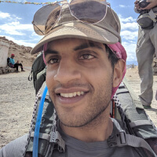

# AI for Healthcare Nanodegree Instructor Biographies

#### Emily Lindemer - Director of Data Science & Analytics, Wellframe
Emily is an expert in AI for both medical imaging and translational digital healthcare. She holds a PhD from Harvard-MIT's Health Sciences & Technology division and founded her own digital health company in the opioid space. She now runs the data science division of Wellframe.  
     

#### Mazen Zawaideh - Radiologist
Mazen Zawaideh is a Neuroradiology Fellow at the University of Washington, where he focuses on advanced diagnostic imaging and minimally invasive therapeutics. He also served as a Radiology Consultant for Microsoft Research for AI applications in oncologic imaging.  
   

#### Ivan Tarapov - Senior Program Manager, Microsoft Research
At Microsoft Research, Ivan works on robust auto-segmentation algorithms for MRI and CT images. He has worked with Physio-Control, Stryker, Medtronic, and Abbott, where he has helped develop external and internal cardiac defibrillators, insulin pumps, telemedicine, and medical imaging systems.  
    

#### Michael DAndrea - Principal Data Scientist, Genentech
Michael is on the Pharma Development Informatics team at Genentech (part of the Roche Group), where he works on improving clinical trials and developing safer, personalized treatments with clinical and EHR data. Previously, he was a Lead Data Scientist on the AI team at McKesson's Change Healthcare.  
    

#### Nikhil Bikhchandani - Data Scientist, Verily Life Sciences
Nikhil Bikhchandani spent five years working with wearable devices at Google and Verily Life Sciences. His work with wearables spans many domains including cardiovascular disease, neurodegenerative diseases, and diabetes. Before Alphabet, he earned a B.S. and M.S. in EE and CS at Carnegie Mellon.  
     

