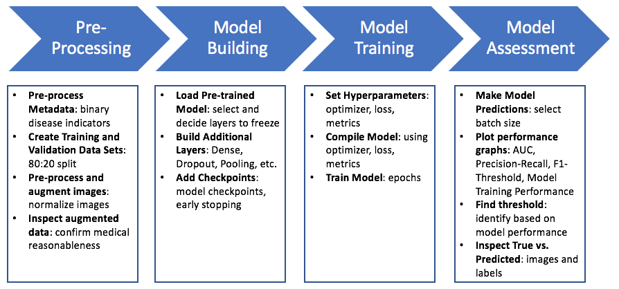
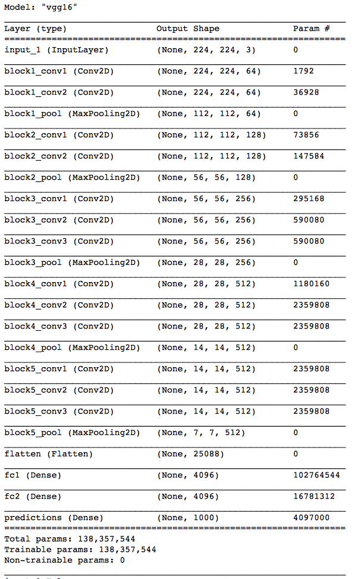
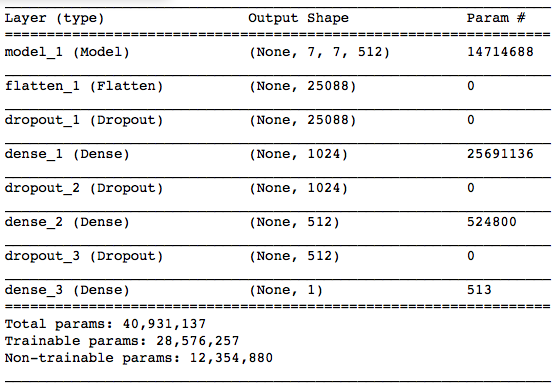
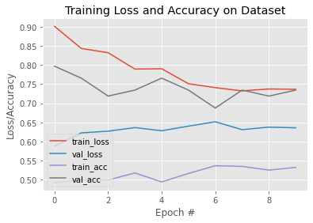
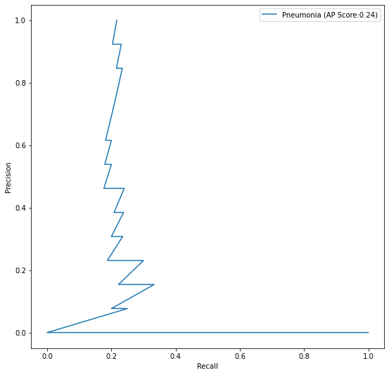
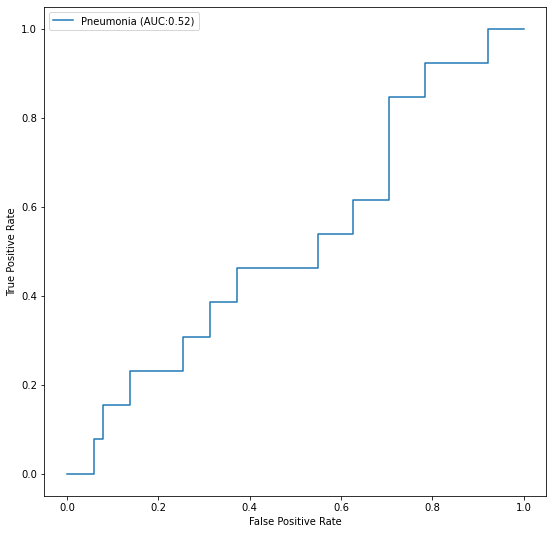
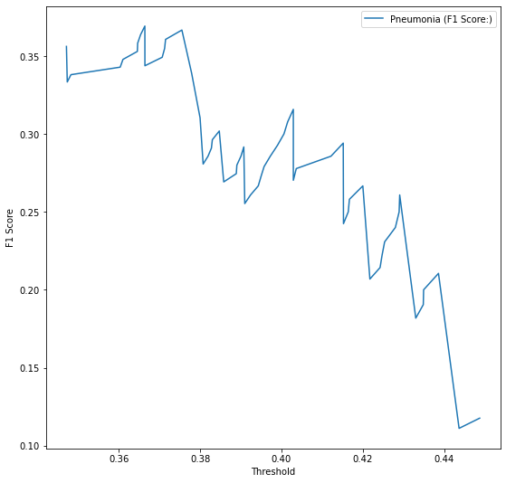

# FDA  Submission

**Your Name:** Rob Straker

**Name of your Device:** Convolutional Neural Network Model for Detecting Pneumonia from Chest X-rays

## Algorithm Description 

### 1. General Information

**Intended Use Statement:** This algorithm is intended to assist the radiologist in the detection of pneumonia from chest x-ray studies.

**Indications for Use:** This algorithm is indicated for use for chest x-ray screening studies on men and women betwen the ages of 20-80 years old.

**Device Limitations:** The algorithm performs moderately on the accurate detection of pneumonia. In particular, the rates of precision and recall are very important standards for this device. A False Positive diagnosis would inflict stess and perhaps financial burden, while a False Negative could have significant health implications.

**Clinical Impact of Performance:** The algorithm is expected to improve prioritization of radiologist workflow, increase the speed to producing radiological reports, and reducing radiologist burnout.

### 2. Algorithm Design and Function

**DICOM Checking Steps:** The following checks wre made on the DICOM images:
1. Confirm body part is 'Chest'.
2. Confirm modality is 'DX', which stands for Digital Radiography.
3. Confirm patient position is either 'AP' (Anterior/Posterior) or 'PA' (Posterior/Anterior). 

**Preprocessing Steps:** Preprocessing was completed on both the metadata and the images as follows:

*Metadata:*
1. Column Creation. Split "Finding Labels" column into one column per disease, with a binary flag.
2. Pneumonia Class. Create a column for 'Pneumonia Class' that identifies

*Images:*
1. Image resizing. Resize images to consistent square (224, 224) image size.
2. Image normalization. Subtract mean intensity from images, then divide by standard deviation.

**CNN Architecture:** A pre-trained VGG-16 model was used, with 16 of its 17 layers frozen, and combined with a series of full connected layers. The architecture is as follows:

### 3. Algorithm Training

**Parameters:**
* Types of augmentation used during training:
    - rescale=1. / 255.0
    - horizontal_flip = True 
    - vertical_flip = False
    - height_shift_range= 0.1
    - width_shift_range=0.1
    - rotation_range=20
    - shear_range = 0.1
    - zoom_range=0.1)
    
* Batch size = 64

* Optimizer learning rate = 1.0e-6

* Layers of pre-existing architecture that were frozen:
    - block1_conv1 False
    - block1_conv2 False
    - block1_pool False
    - block2_conv1 False
    - block2_conv2 False
    - block2_pool False
    - block3_conv1 False
    - block3_conv2 False
    - block3_conv3 False
    - block3_pool False
    - block4_conv1 False
    - block4_conv2 False
    - block4_conv3 False
    - block4_pool False
    - block5_conv1 False
    - block5_conv2 False
    
* Layers of pre-existing architecture that were fine-tuned:
    - block5_conv3 True
    - block5_pool True
    
* Layers added to pre-existing architecture:

    Model: "sequential_2"
    _________________________________________________________________
    Layer (type)                 Output Shape              Param #   

    =================================================================
    model_2 (Model)              (None, 7, 7, 512)         14714688  
    _________________________________________________________________
    flatten_2 (Flatten)          (None, 25088)             0         
    _________________________________________________________________
    dropout_4 (Dropout)          (None, 25088)             0         
    _________________________________________________________________
    dense_4 (Dense)              (None, 1024)              25691136  
    _________________________________________________________________
    dropout_5 (Dropout)          (None, 1024)              0         
    _________________________________________________________________
    dense_5 (Dense)              (None, 512)               524800    
    _________________________________________________________________
    dropout_6 (Dropout)          (None, 512)               0         
    _________________________________________________________________
    dense_6 (Dense)              (None, 1)                 513       

    =================================================================
    Total params: 40,931,137
    Trainable params: 28,576,257
    Non-trainable params: 12,354,880
    _________________________________________________________________

**Final Threshold and Explanation:**
The final threshold was determined by finding that value that maximized F1 score, which is also know as the harmonic mean of precision and sensitivity. In this way, the final threshold acheives a balance between the largely competing interests of these two component measures.

Final Threshold = 0.38

### 4. Databases

**Description of Training Dataset:** 
The dataset was split 80:20, with 80% of images assigned to training dataset and 20% to validation dataset. The split was made so as to ensure equal proportions of pneumonia and no pneumonia in training data set and validation data set. A total of 2290 images were generated for the training data set.

**Description of Validation Dataset:** 
Efforts were made to ensure representative proportions of pneumonia and no pneumonia in the validation data set, in order to match the 20:80 prevalence of pneumonia and to pneumonia in a clincial setting like this. A total of 1430 images were generated for the validation data set.

### 5. Ground Truth

The ground truth for this algorithm is the Silver standard of labels from multiple radiologists, since  it’s really hard for radiologists to consistently identify 'pneumonia' / 'no pneumonia' labels. The most commonly identified label by this group would be the ground truth.

### 6. FDA Validation Plan

**Patient Population Description for FDA Validation Dataset:** Patient population consists of men and women, distributed 60:40 in favour of men, betwen the ages of 20-80 years old, who have had a digital radiography of the chest.

**Ground Truth Acquisition Methodology:** Recruit 7 board-certified radiologists to identify pneumonia or 'no pneumonia' labels for the entire image data set. It's expected that a minimum of 5 would provide labels for any particular image, so that 3 or more would constute a 'label' decision.

**Algorithm Performance Standard:** The key metric that makes up the performance standard for the algorithm is as follows:
- *F1 = 2 * (precision x recall) / (precision + recall) = 0.387*
- Also known as the harmonic mean of precision and sensitivity.
- This is based on real radiologist performance.
